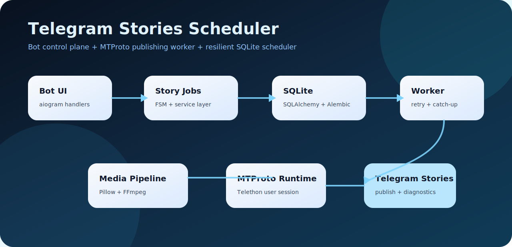

# Telegram Stories Scheduler

> Schedule Telegram Stories from a bot, publish them through a real Telegram account, and keep posting reliably even when the network is unstable.



[](https://www.python.org/)
[](https://docs.aiogram.dev/)
[](https://docs.telethon.dev/)
[](https://www.sqlalchemy.org/)
[](LICENSE)

Telegram Stories Scheduler is a local-first app for people who need Telegram Stories to go out on time without opening Telegram manually every day. The operator controls the schedule from a Telegram bot, while a separate worker publishes stories through a personal Telegram session using MTProto.

The project is built like a small production service: clear runtime boundaries, SQLite persistence, media preparation, retries, health checks, and a test suite focused on the failure cases that usually break automation tools in real life.

## Who This Is For

- **Business operators** who want scheduled Telegram Stories without daily manual posting.
- **Small teams and agencies** that need a simple local tool instead of a full marketing platform.
- **Developers and reviewers** who want to see practical Python engineering around Telegram Bot API, MTProto, async runtime supervision, persistence, retries, and packaging.

## What It Does

- **Schedules stories** for a specific date and time or for selected weekdays.
- **Accepts photos and videos** through the bot and prepares them before publishing.
- **Publishes through MTProto**, so stories are sent from a real Telegram account session.
- **Keeps working through network problems** with retry windows, health checks, and recovery logs.
- **Lets an operator force-send by ID** when a story needs to be posted manually.
- **Shows current jobs** with statuses that are understandable to a non-technical user.
- **Deletes or cancels jobs safely** depending on their current state.

## Engineering Highlights

- **Two independent runtime planes**: the bot control panel and the story publisher are supervised separately, so a Bot API issue does not automatically stop scheduled posting.
- **MTProto session lifecycle**: the app validates, refreshes, and reuses Telethon sessions while avoiding common SQLite session-lock pitfalls.
- **Recovery-first scheduling**: failed one-time stories retry during the same local day; weekly stories roll forward without creating duplicate posts.
- **Media fallback path**: large Bot API media can be downloaded through MTProto when normal bot downloads hit platform limits.
- **Observable failure handling**: network degradation, reconnects, timeouts, media rejections, and manual-send results are logged with operator-friendly messages.
- **Cross-platform delivery**: source CLI for development, Windows batch wrappers, and PyInstaller build support for one-file executables.
- **Regression coverage**: 120+ tests cover scheduling rules, bot handlers, auth flow, worker recovery, media ingress, database behavior, and packaging helpers.

## Architecture

```text
Telegram Bot UI
      |
      v
aiogram handlers + FSM
      |
      v
StoryJobService ---- SQLite / SQLAlchemy / Alembic
      |
      v
WorkerService ---- StoryDispatchService ---- Telethon MTProto client
      |                    |
      |                    v
      |              Photo/video preparation
      v
Connectivity monitor + retry policy
```

## Feature Overview

| Area | Details |
| --- | --- |
| Bot UI | `/start`, schedule story, list jobs, delete by ID, force-send by ID |
| Scheduling | one-time posts, weekly recurrence, local timezone, same-day retry window |
| Publishing | Telegram user-session publishing with Telethon MTProto |
| Media | photo normalization, video preparation, FFmpeg integration, large-file fallback |
| Storage | SQLite database, async SQLAlchemy 2.x, Alembic migrations |
| Runtime | unified launcher, bot/worker supervision, process lock, connectivity diagnostics |
| Auth | interactive phone/code/2FA authorization and explicit re-auth mode |
| Delivery | Python CLI, Windows wrappers, PyInstaller one-file build support |

## Quick Start

```bash
python -m venv .venv
source .venv/bin/activate
pip install -e ".[dev]"
cp .env.example .env
```

Add your own Telegram credentials to `.env`:

```dotenv
BOT_TOKEN=
API_ID=
API_HASH=
PHONE_NUMBER=
```

Authorize the Telegram account that will publish stories:

```bash
python scripts/stories.py auth
```

Run the bot and worker separately during development:

```bash
python scripts/stories.py bot
python scripts/stories.py worker
```

Or start the combined local launcher:

```bash
python scripts/stories.py
```

## Configuration

| Variable | Purpose |
| --- | --- |
| `BOT_TOKEN` | Telegram bot token from BotFather |
| `BOT_ALLOWED_USER_IDS` | optional comma-separated Telegram user IDs allowed to operate the bot |
| `API_ID`, `API_HASH` | Telegram API application credentials |
| `PHONE_NUMBER` | optional phone prefill for interactive auth |
| `APP_TIMEZONE` | local scheduling timezone |
| `MAX_VIDEO_SIZE_BYTES` | maximum accepted video size |
| `MTPROTO_CONNECT_TIMEOUT_SECONDS` | upper bound for MTProto runtime setup |
| `MTPROTO_PROBE_TIMEOUT_SECONDS` | upper bound for MTProto health probes |
| `MTPROTO_PUBLISH_TIMEOUT_SECONDS` | upper bound for one publish operation |
| `WORKER_CYCLE_TIMEOUT_SECONDS` | safety timeout for one worker loop iteration |
| `BOT_PROXY_URL` | optional Bot API proxy |
| `TELEGRAM_MTPROXY_HOST`, `TELEGRAM_MTPROXY_PORT`, `TELEGRAM_MTPROXY_SECRET` | optional MTProto proxy settings |

Only `.env.example` is committed. Real `.env` files, sessions, SQLite databases, media files, logs, and build outputs are ignored.

## Commands

```bash
python scripts/stories.py auth
python scripts/stories.py bot
python scripts/stories.py worker
python scripts/stories.py
```

Windows wrappers:

```powershell
scripts\stories.bat auth
scripts\stories.bat bot
scripts\stories.bat worker
```

## Testing

```bash
pytest -q
python -m compileall app tests scripts migrations
```

The suite checks the parts that matter most for a scheduling product: date/time rules, missed-post recovery, manual send, bot handlers, auth/session handling, media download and preparation, SQLite repositories, worker retries, and runtime health checks.

## Build

Build a one-file executable on the target OS:

```bash
python scripts/build_executables.py
```

Windows is the primary packaging target. A best-effort Wine helper is included for Linux-based build experiments:

```bash
./scripts/build_windows_via_wine.sh
```

For a real distribution, build and smoke-test on the target operating system.

## Repository Hygiene

This repository contains only generic source code, tests, this README, MIT license, CI config, and `.env.example`.

It does **not** contain private runtime data, real credentials, Telegram sessions, local databases, media files, customer files, chat logs, packaged private builds, or internal planning materials.

## License

MIT. See [LICENSE](LICENSE).
